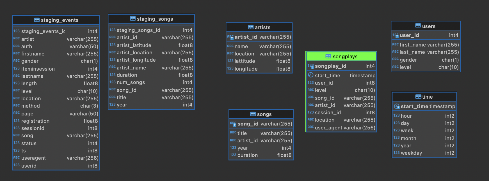

# Data Warehouse

## Introduction

A music streaming startup, Sparkify, has grown their user base and song database and want to move their processes and data onto the cloud. Their data resides in S3, in a directory of JSON logs on user activity on the app, as well as a directory with JSON metadata on the songs in their app.

As their data engineer, you are tasked with building an ETL pipeline that extracts their data from S3, stages them in Redshift, and transforms data into a set of dimensional tables for their analytics team to continue finding insights into what songs their users are listening to. You'll be able to test your database and ETL pipeline by running queries given to you by the analytics team from Sparkify and compare your results with their expected results.

## Project Description

In this project, you'll apply what you've learned on data warehouses and AWS to build an ETL pipeline for a database hosted on Redshift. To complete the project, you will need to load data from S3 to staging tables on Redshift and execute SQL statements that create the analytics tables from these staging tables.

## Database Schema

* Staging Tables
    * `staging_events` information about action of the users from web app.
    * `staging_songs` information about artists and songs.
* Fact Table
    * `songplay` records in event data associated with song plays i.e. records with page `NextSong`
* Dimension Tables:
    * `users` users in the app
    * `songs` ongs in music database
    * `artists` artists in music database
    * `time` timestamps of records in songplays broken down into specific units

## Data Source

This project is using a S3 Bucket for extract necessary information for load staging tables firstly.
* Song data: `s3://udacity-dend/song_data`
* Log data: `s3://udacity-dend/log_data`
* Json Schema for `staging_events` table `s3://udacity-dend/log_json_path.json`

## Project Structure

* `dwh.cfg` credentials really important to config before run scripts (RedShift database and IAM role info)
* `create_tables.py` drops and creates all tables. whenever you want to reset your database and test your ETL pipeline.
* `etl.py` load data from S3 to staging tables on Redshift and load data from staging tables to analytics tables on Redshift
* `sql_queries.py` contains all necessary sql queries, drop, create insert tables and copy data from S3 Bucket

## How to Run

* Create Tables
    - Run `create_tables.py` to create all tables.
* Build ETL Pipeline
    - Run `etl.py`, extract `.csv` files from S3 Bucket and insert all data.
